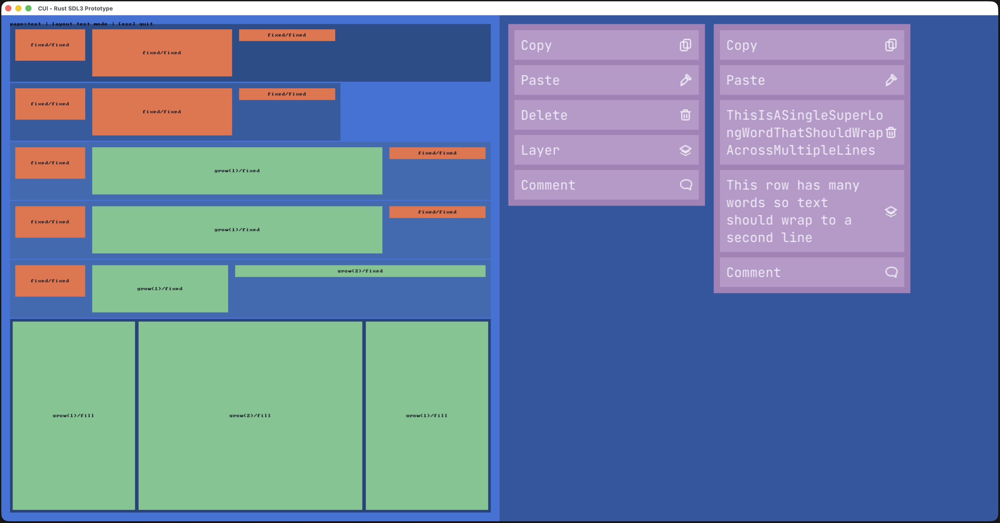

# rui

[](https://github.com/akurilin/rui/actions/workflows/ci.yml)
[](https://deepwiki.com/akurilin/rui)
[](https://www.rust-lang.org/)
[](https://github.com/vhspace/sdl3-rs)
[](https://github.com/rust-lang/rustfmt)
[](https://github.com/rust-lang/rust-clippy)

Rust SDL3 UI app workspace.

## WIP Notice

This project is very much a work in progress.

Most planned features are not implemented yet, and the current app should be treated as an early prototype while core architecture and layout/runtime behavior are still evolving.

## Project Status

This repository is now Rust-only. The legacy C/CMake implementation has been removed.

Current app scope:

- SDL3 app loop with resizable window lifecycle
- startup viewport sizing (`--width`, `--height`)
- startup page selection (`--page test`)
- single active page: `test`
- stack layout primitives in `cui_app/src/pages/layout.rs` (`VStack`, `HStack`, `SizeMode`, overlays)
- SVG icon rendering via SDL_image on the test page
- TTF font rendering via SDL_ttf for right-pane menu labels, including wrapped text rows
- lightweight overlay status text (`page=<id> | layout test mode | [esc] quit`)
- repo quality checks wired through `make precommit` (`cargo fmt --check`, `cargo clippy`, `cargo test`)
- tests currently act as a compile/run smoke check (no unit tests defined yet)

## Main Page Screenshot



## Repository Layout

- `Cargo.toml`: workspace manifest
- `Cargo.lock`: workspace lockfile
- `Makefile`: Rust development shortcuts
- `.githooks/pre-commit`: local pre-commit checks
- `.github/workflows/ci.yml`: GitHub Actions CI workflow
- `cui_app/`: application crate
- `assets/icons/`: SVG icon assets used by prototype UI elements
- `assets/fonts/`: bundled TTF font assets used by UI text rendering
- `docs/`: design and planning notes for Rust layout/runtime evolution
- `scripts/capture_app_window.sh`: macOS helper to capture app window screenshots

## Requirements

- Rust toolchain (`cargo`, `rustfmt`, `clippy`)
- GNU `make`
- macOS for `scripts/capture_app_window.sh` (uses `swift` + `screencapture`)

## Build, Run, Test

From repository root:

```bash
cargo build -p cui_app
cargo run -p cui_app
cargo test -p cui_app
```

Or use Make targets:

```bash
make build
make run
make test
make format
make format-check
make lint
make precommit
make install-hooks
```

`make run` defaults to:

```text
--page test --width 2304 --height 1296
```

Override with `RUN_ARGS` or `ARGS`:

```bash
make run RUN_ARGS="--page test --width 1920 --height 1080"
```

## CLI

`cui_app` accepts:

- `--page <id>` (currently only `test`)
- `-w, --width <pixels>`
- `-h, --height <pixels>`
- `--help`

Show help:

```bash
cargo run -p cui_app -- --help
```

## Git Hooks (Local)

Install repo-managed Git hooks:

```bash
git config core.hooksPath .githooks
```

Or run:

```bash
make install-hooks
```

Current pre-commit flow:

```bash
make precommit
```

`make precommit` runs:

- `cargo fmt --all --check`
- `cargo clippy -p cui_app --all-targets --all-features`
- `cargo test -p cui_app`

## GitHub Actions (CI)

GitHub Actions runs the same baseline checks from `.github/workflows/ci.yml` on:

- `push`
- `pull_request`
- manual trigger (`workflow_dispatch`)

## Screenshot Capture (macOS)

Build once, then capture the app window to `/tmp`:

```bash
cargo build -p cui_app
scripts/capture_app_window.sh ./target/debug/cui_app /tmp/rui-test-page.jpg 2 -- --page test --width 1920 --height 1080
```

Capture files are intended to be ephemeral validation artifacts.
